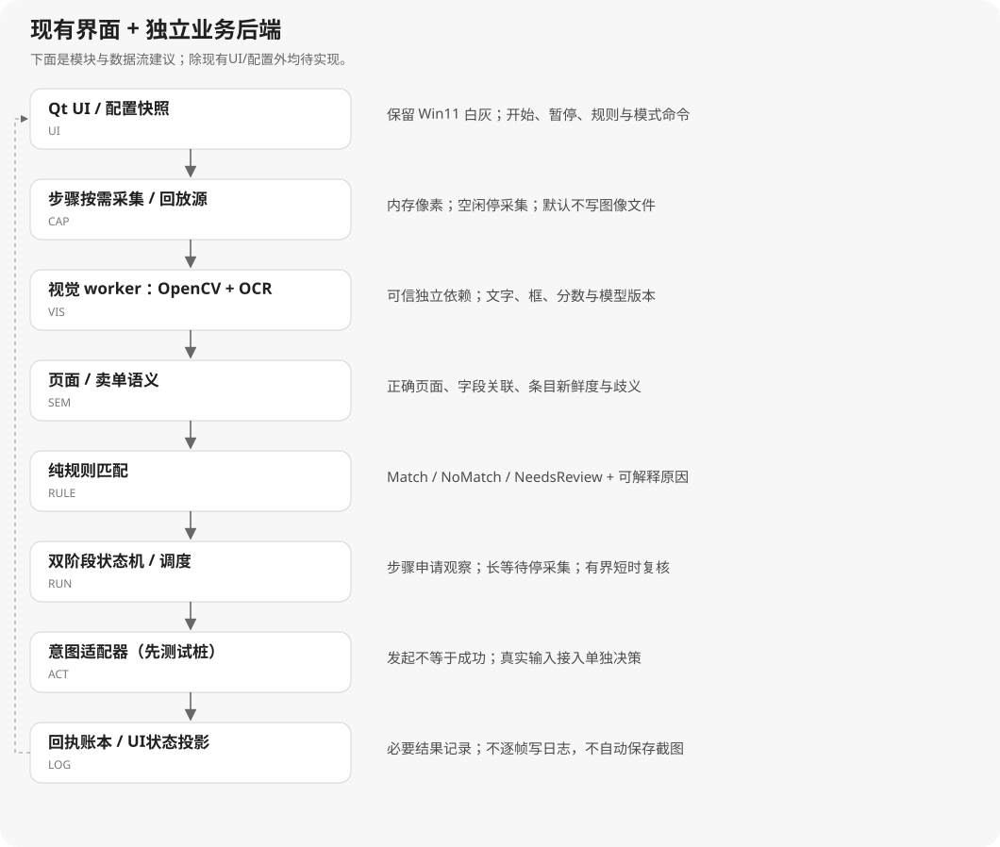

# 02 · 图像识别与系统架构

## 1. 回答“是不是 OpenCV 图像识别”

| 本地证据 | 能确认什么 | 尚不能推出什么 |
|---|---|---|
| 目录存在 `cv2`，E01 初始清单 | 发行包包含 OpenCV Python 生态组件 | 主业务的每种定位均由 OpenCV 执行 |
| E10 `gdi32.dll` 偏移 `0x4af010` 含 OpenCV / MatExpr | OCR 相关库包含 OpenCV 实现痕迹 | 确切编译版本、调用算法及参数 |
| E02 导出 `TomatoOCR`、`ocrScreen/ocrWindow/ocrImageData`；资源 `CLS/DET/REC/REC_NUMBER/REC_V3` | 该文件实际承担 OCR 接口与模型资源角色 | 所有资源都曾被运行时选中 |
| E10 `0x5045b0` 为 `ppocrv5`；`0x5d9238` 指向 MNN 工程的 TomatoOCR PDB | 存在 OCR 模型/推理工程线索 | 运行时确定启用 PP-OCRv5、MNN 或具体权重 |
| E04 原始 `location/score/words`，归一化 `region/words/box/center`；全屏及局部区域 | 文字、框和可信度参与页面/价格/磨损/时间业务 | 仅凭日志完整复现原截图和图像算法 |
| E04 `CreateCompatibleDC failed` | 存在 GDI 类截图路径线索 | 所有截图模式都只使用 GDI |

因此，新方案把四层明确分开：**截图获得像素 → 图像预处理/锚点 → OCR 文字与几何 → 页面/卖单语义**。任何一层失败都产生可解释的 Unknown，不将空结果当成零价格或已到购买时间。[E02、E04、E10；设计]

### 特别区分：BBZPS反复识别，不等于反复落盘图片

历史日志能证明多次全屏/区域OCR记录；日志文件和部分历史结果PNG也确实存在。但这些证据尚未确认“每次OCR都重新获取一帧”，更没有确认“每次先写图片、再读图片、再删除图片”，也不证明它全天无间断采集。[E01、E04、E09]

OCR库导出的 `ocrScreen/ocrWindow/ocrImageData/ocrFile` 说明接口选择存在，单看导出表尚不足以确定业务实际走哪条路径，也不排除库内部的其他行为。BBZPS逐帧图像是否落盘属于未确认项；本轮仍未运行它或跟踪其运行时磁盘IO。[E02]

v0.1的“临时帧文件传给worker”是**我们曾提出的重构草案**，不是对BBZPS实现的结论。v0.2按用户要求改为按步骤申请、内存传图、默认零图片文件写入；这也是待实现的设计约束，不是新引擎已测性能。[E12]

## 2. 独立重构的推荐组合

| 层 | 首轮决定 | 比较项/退出条件 | 资料 |
|---|---|---|---|
| UI | 保留当前 Qt 6.8 / MinGW 工程 | 不因为 OCR 选型重写界面 | E08、R14 |
| 采集 | `ICaptureSource`；步骤按需申请；先图片回放，再比较 Windows Graphics Capture 与 Desktop Duplication | 步骤之外停采集；按窗口、遮挡、缩放、多显示器实测；无临时图片写入 | E12、R03–R05 |
| 图像 | 独立来源的 OpenCV，原图及 ROI 暂存内存，用完归还缓冲区 | 默认不编码/保存PNG或JPEG；模板和预处理候选用同一标注集评测 | E12、R01–R02 |
| OCR | `IOcrProvider`；优先评估独立 PaddleOCR 中文/数字方案 | 记录检测+识别或已裁切识别两种路径；比较价格、磨损、倒计时字段正确率和延迟 | R06–R07 |
| 视觉进程 | 与 Qt UI 分离的可信本地 worker | UI工具链保留；模型/推理依赖独立封装，使用版本化IPC | R10–R11、R14 |
| 规则/状态 | 原生 C++ 纯函数+事件状态机 | 与 OCR 实现无关；测试可注入人工标注观测 | 本项目设计 |
| 配置/账本 | QSaveFile 保存配置；SQLite 是账本候选 | 配置提交失败保留旧文件；事务/重复回执/崩溃恢复单独测试 | R12–R13 |

**这里的“优先评估”不是模型选型已完成。** 本轮未安装生产 OCR、未下载运行模型、未给出识别率或速度实测。不能把原库的 `ppocrv5` 字符串当成必须选用同模型的理由。

当前构建脚本指向 Qt 6.8.3 / MinGW 13.1.0。MSVC 编译的 C++ 库不能未经 ABI/运行库核对直接当成可链接的 MinGW 依赖。先以独立进程隔离推理工具链；若后续选择进程内 C++，要求统一编译器、架构、运行库和 Debug/Release 组合，并在干净机器验证。R14、R15 提供 Qt 工具链和部署背景；具体第三方包还需独立构建验证。

## 3. 模块边界

可编辑源：[architecture.mmd](diagrams/architecture.mmd)。图中所有业务后端模块均是拟建；UI/配置属于现有基线，需按阶段扩展。

| 模块 | 输入 → 输出 | 禁止混入的职责 |
|---|---|---|
| `CAP` | 步骤观察申请+窗口/已有回放素材 → 内存 `FrameEnvelope` | 不在空闲时循环取帧，不生成临时图片，不识别价格 |
| `VIS` | Frame + ROI配置 → OCR结果/锚点 | 不决定交易、不私自改变任务 |
| `NAV` | OCR/锚点+上下文 → `PageObservation` | 不把单个按钮文字当成整页确认 |
| `LISTING` | 页面观测 → 独立卖单观测及关联质量 | 不把坐标当永久ID |
| `RULE` | RuleSnapshot + ListingObservation → `Decision` | 无输入操作、无截图、无系统时钟依赖 |
| `RUN/COLLECT` | 决策/回执/停止事件 → 状态变化/意图 | 不直接依赖窗口API |
| `CLOCK/SCHED` | 单调时间+倒计时观测+策略 → 有代次的计划 | 不修改系统时间、不自行证明商品可买 |
| `ACTION` | 已核验意图 → 本地测试适配器的发起事件 | 不充当成交事实来源；M1–M3默认不接真实动作 |
| `LEDGER/OBS` | 业务事件 → 持久化账本/统计；可选手动图片导出索引 | 不逐帧落日志，不自动落图，不以“点击次数”填“成功数量” |
| `UI/CFG` | 用户参数、状态投影 → 显示/配置/命令 | 不在按钮槽函数写图像识别和动作循环 |

## 4. Frame 与坐标契约

### 步骤触发与内存处理：已确认产品约定

用户在2026-10-06明确补充“到了步骤就实时采集”“截图不要保存磁盘”，记录为E12。**这项约定取代v0.1的临时帧文件传递方案，也不采用常驻全速采集。** 它是待实现的规格，不是当前前端已有能力。

| 业务时机 | 观察方式 | 停止条件 |
|---|---|---|
| 空闲、暂停、已结束 | 不申请画面，停用/释放采集会话；OCR模型可驻留内存 | 新业务步骤明确申请观察 |
| 检查页面、字段、条件 | 步骤开始后取新帧，优先处理指定ROI | 获得有效结果或到达重试预算 |
| 翻页/切页/操作后等反馈 | 开启短时 `bounded_watch`，只在该步骤内按间隔观察 | 页面稳定、收到回执、超时、取消或帧数用尽 |
| 长公示等待 | 根据最近估计安排唤醒，不常驻取帧；唤醒后重新观察 | 进入临近时段的有界观察或状态变化 |
| 成交/失败回执阶段 | 当前步骤内短时观察，并保存结构化结果 | 回执可分类或进入Unknown；默认不落图 |

观察申请必须带 `run_id/step_id/cancel_epoch/viewport_generation/ROI/timeout/frame_budget`；单次模式返回一个结果，有界观察模式允许在预算内重试。步骤结束即撤销需求，停止后续截图、OCR和定时器。暂停不只是丢弃OCR结果，采集端也要停止持续取帧。[设计，依据E12]

需要实时观察时，图像始终以原始像素缓冲区/内存句柄传递，避免“写PNG → 识别进程读PNG”。默认采用**1个处理槽+1个待处理槽**；同一步骤中用新帧替换过期的待处理帧，用完归还缓冲区。跨步骤/窗口代次的帧作废，新步骤必须取得越过其新鲜度屏障的新画面。该槽数是初始设计，后续评估也必须维持明确内存上限。

内存传递并不承诺GPU与CPU之间零复制；选择实际像素路径时测量转换和复制成本。应用层默认不写图片/临时帧文件；不为此关闭操作系统页面文件，也不把正常配置和业务账本写入算作截图行为。

策略示例：[observation-policy.sample.json](examples/observation-policy.sample.json)。默认 `on_success=false`、`on_error=false`、`temporary_image_files=false`；显式调试导出还需数量、容量及到期限制。离线回放可以只读已有测试图片，但不写中间截图。

### 坐标和新鲜度

`FrameEnvelope` 至少包含：`frame_id`、`capture_session_id`、`source_kind`、窗口引用、客户区物理尺寸、DPI、视口代次、捕获起止单调时间、墙上时间标签、像素格式、帧摘要、图像句柄。截图完成时间不能冒充像素实际产生时间；初期用捕获区间表达不确定性。[设计]

每个 ROI 含 `roi_id`、坐标空间、区域、变换版本。OCR 框先映回帧坐标，再映回客户区；动作适配器如将来使用屏幕坐标，再作最后一步转换。窗口移动、DPI/尺寸变化时递增 `viewport_generation`，让旧框、旧卖单位置和排队动作整体过期。[R05；设计]

- 原始框采用四点多边形保留旋转信息；中心点只是派生字段，不作为身份字段。
- 帧被裁切、缩放或二值化时在内存保留前后变换；调试结果可映射回内存原图，默认不保存图像文件。
- 黑屏、零尺寸、访问丢失、目标窗口消失、OSD污染均有独立错误码。
- 同时观察多个窗口时，不混用窗口引用、DPI或坐标代次。

## 5. 视觉 worker 协议草案 v1

初期使用 `QProcess` 启动项目自带、绝对路径指定的可信 worker，使用标准输入/输出传送 UTF-8 NDJSON；stderr 独立保存诊断，不把普通日志混入 JSON 通道。Qt 的 QProcess 提供独立进程和输出读取接口。[R11；其余是新协议设计]

NDJSON只传控制消息、像素缓冲区描述和识别结果。实时像素通过进程内缓冲区或进程间共享内存交付；不将图像转成Base64塞入JSON，不以磁盘映射文件或临时图片作实时IPC。日志采用关键事件与限速汇总，默认不输出逐帧OCR全文。[E12；设计]

| 消息 | 必备字段 | 约束 |
|---|---|---|
| `hello` / `ready` | protocol_version、session_id、worker_build、模型ID/哈希、能力列表 | 不支持版本不开始任务 |
| `recognize` | request_id、step_id、frame_id、共享内存描述符、ROI列表、generation、相对时间预算 | 描述符包含像素格式/尺寸/stride/有效长度/租约ID；只接受本次会话分配的缓冲区；实时模式不接受文件路径 |
| `result` | request_id、frame_id、generation、provider、耗时、文字/框/分数、状态 | 过期/旧会话结果丢弃；分数只作候选信号 |
| `release_frame` | frame_id、租约ID、会话代次 | worker确认结束读取后再复用缓冲区；异常退出则先结束读取方再回收 |
| `cancel` | request_id、step_id 或 session_id | 停止后结果不得继续驱动规则；撤销观察需求并回收资源 |
| `error` | 稳定错误码、可诊断消息、是否可重试 | 错误不是有效空页面 |

拟定限制：每行 JSON ≤ 1 MiB，单请求文本框 ≤ 2,000 个，图像像素数量和缓冲区字节数设独立上限；这些是协议保护上限，不是已测性能指标。步骤内队列采用上述双槽上限，禁止落后几秒仍按旧结果动作。步骤结束不再产帧；共享内存失败进入明确错误，不自动改用临时文件。绝对 deadline 使用协调端时钟；跨进程若不共享时基则只交换相对预算。[设计]

示例：[vision-result.sample.json](examples/vision-result.sample.json)。它标有 `example_only`，没有假造真实截图。

## 6. 识别决策和评估方法

1. 建独立标注集：页面类型、字段文本、字段框、对应卖单、状态；划分训练/调参集与留出测试集。同一连续画面的近重复帧不跨集合。
2. 同一图片至少比较原图 OCR、有限预处理 OCR、ROI专用识别；模板候选只负责锚点，不拿模板相似度替代价格真值。[R01、R02、R06、R07]
3. 输出页面准确率/Unknown率、价格和磨损**字段精确匹配率**、行关联正确率、倒计时误差、误匹配率；不能只报平均 OCR 分数。
4. 测试空白、遮挡、弹窗、千分位、相似字符、非目标窗口、价格换行、同款相邻卖单、窗口切换和高DPI。
5. 记录 CPU/GPU、分辨率、provider/模型哈希、冷启动与热运行 P50/P95/P99、内存峰值和帧过期率。数字在 M2 实测，当前不填“实时/毫秒级”宣传值。
6. 分类阈值从验证集拟合，保留拒绝判定区；多个引擎的置信度不是天然可比较概率。低分或几何关联不明产生 NeedsReview。

目前的历史日志能做业务事件回放，但多数原始截图未可用；不能用 OCR 的历史文字结果衡量 OCR 自身精度。缺失图片情况见 E09，新的视觉基准需独立建立。
