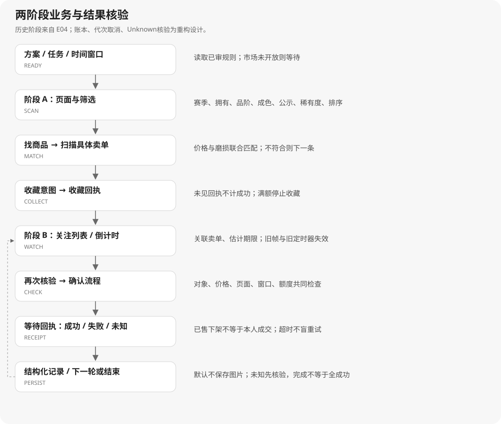

# 04 · 状态机与业务规则

## 1. 历史流程与新设计的分界

历史证据确认了“筛选收藏 → 关注列表 → 倒计时/确认 → 结果处理”的路径。[E04] 下图是结合新可靠性要求形成的**建议状态机**，不是已恢复的原程序函数调用图；其中代次取消、幂等账本和未决预留是新增设计。



可编辑源：[business.mmd](diagrams/business.mmd)。总控事件 `Stop/WindowLost/ModeChanged` 可使任意待办失效；已经可能发出的外部操作进入核验，不当成已撤销。

## 2. 状态与转换契约

| 状态 | 进入条件 | 允许产生的结果 | 超时/异常 |
|---|---|---|---|
| Ready | 方案有效、规则已审、模式明确 | 创建run与规则快照 | 未审配置留在Ready并显示原因 |
| AwaitSchedule | 用户定时/市场开放未满足 | 等待观察，不生成业务动作 | 时间/市场状态未知→Paused |
| Observe | 捕获/页面状态可用 | 确定页面，选择收藏或关注阶段 | 有界观察重试后Recover |
| ConfigureFilter | 目标页存在 | 设置筛选意图并回读 | 无回执不推进；未知页重新定位 |
| ScanListings | 筛选已确认 | 翻页、关联卖单、字段提取 | 重复页/找不到目标→记录并换任务 |
| Evaluate | 观测完整且新鲜 | Match / NoMatch / NeedsReview | 缺数据不会变宽松规则 |
| AwaitCollectReceipt | 已生成收藏意图 | 明确成功后记入关注关系 | 关注满→Watchlist；结果不明→Reconcile |
| Watchlist | 收藏结束/满额/选择仅关注模式 | 卖单观测、待公示队列 | 目标消失→重新核验关联 |
| AwaitDeadline | 倒计时区间与计划存在 | 到点唤醒并Revalidate | 观测反跳/旧帧/时钟退化→重新估计 |
| Revalidate | 唤醒后最新页面/卖单存在 | 准备一次带有效期的意图 | 价格/关联/窗口改变→取消旧意图 |
| AwaitConfirm | 意图已登记，测试适配器发起 | 匹配确认弹窗，必要时二次确认 | 不匹配/失焦→停止余项并核验 |
| AwaitReceipt | 操作可能已发出 | Success / Failed / Unknown | 超时→Unknown，非盲目重试 |
| PersistResult | 回执可关联且账本事务完成 | 更新计数、留证、退出结果页 | 存储失败→暂停，UI不先加成功数 |
| Reconcile | 未知结果/重启存在未决attempt | 重新观察、人工确认或保持未知 | 无法区分时继续占用预留 |
| Recover | 捕获/OCR/导航失败 | 有界回读、重新校准、恢复游标 | 超过恢复预算→Paused |
| Paused / Stopped / Completed | 用户或流程终止 | 显示最终原因及未决项 | 停止不删除账本、完成不等于全成功 |

阶段开关：`autoCollect=false` 时不走收藏动作，但可仅观察关注页；没有有效关注条目就显示空队列。关注满额切换后保留未完成收藏游标，避免每轮从第一条无休止重复。

**采集由上述状态提出需求，不使用常驻全速观察循环。** ConfigureFilter/ScanListings/Revalidate等步骤取当前新帧；AwaitCollectReceipt/AwaitConfirm/AwaitReceipt只在有截止时间和帧预算的短窗口内观察。Ready/Paused/Stopped/Completed及长时间AwaitDeadline关闭采集，定时唤醒再核验。步骤退出即撤销需求、使旧帧/定时器失效。[E12；ADR10]

本章“留证”默认指结构化回执、字段和版本记录，不代表写入截图。图像仅在当前步骤有界内存缓冲中存在，用完释放；成功或超时不会自动启动图片保存。[E12]

## 3. 匹配决策

新规则采用下列顺序，所有比较必须有可追溯观测：

1. 规则启用、审查完成、币值/磨损单位已确定。
2. 观测属于正确窗口/视口代次且尚未过期。
3. 商品关联足够明确；赛季、拥有状态、品阶、成色、稀有度、公示状态按显式条件判断。
4. 价格处于闭区间 `min ≤ price ≤ max`；磨损 `wear ≤ max_wear`；这是本项目拟定边界，**不是BBZPS边界已确证**。
5. 数量与品级限额有剩余空间、未决attempt没有冲突。
6. 输出结果与原因，不在规则函数中截图或点击。

只返回布尔值会丢失“价格不符”和“价格根本没识别出”的差别。建议结果：

```text
Match: 所有必要字段已核验且符合
NoMatch: 至少一个可靠字段明确不符合
NeedsReview: 数据缺失、单位未知、关联歧义、观测过期或配置未确认
```

示例历史记录：`log/BBZ_20260924_090240.log` 第89/91/93行分别出现价格340、磨损1.187788/1.249和联合满足；其后有“成功添加至我的关注”。这证明一个实际的联合匹配/收藏路径，但不证明对应规则恰好等于后来保存的INI。[E04]

## 4. 时间和延迟：先定语义，再做调节

- NTP是本机相对外部时间源的偏移参考，**不是目标市场服务端接受操作时刻的权威证据**。目标界面倒计时、帧龄、网络/渲染/输入延迟都影响结果。即使NTP正常也不能声称已获得精确解锁毫秒。[R16；设计判断]
- 等待与超时用单调时钟；QElapsedTimer在对应Qt版本提供基于稳态时钟的经过时间测量。墙上时间只用于展示和跨日计划标签。[R08]
- Qt定时器可能晚到，触发回调后再次核验截止时间与有效期；`0.005`这类配置值不构成亚毫秒执行精度保证。[R09]
- `purchaseDelayMs` 首个测试策略暂以“确认弹窗首次稳定出现”为 `t0`，计算 `planned=t0+delay`；此定义待D03确认，界面不得以为它已等同于原程序。公示解锁时间是另一个独立条件。
- 动态策略仅在测试模式显式启用：`new = clamp(current + delta, min, max)`。队列满事件给负delta，尝试后仍在公示期给正delta；事件去重、连续次数阈值、成功后复位、最小调整间隔均可配置。**这是拟定策略，不是已还原公式。**[D04]
- 最小值/最大值及触发阈值不填“最佳经验值”；M3先用可控回放验证收敛与边界，再决定产品默认。已有默认830ms属于前端字段，不是推荐最优值。

## 5. 动作、回执与数量

一个动作意图携带：`intent_id/run_id/task_revision/association_ref/frame_id/viewport_generation/cancel_epoch/expected_page/expires_at`。任何前提变化均使意图失效。前端只发运行/暂停/配置命令，不直接发底层输入；M4的动作适配器先连接自有测试窗口。[设计]

账本先记准备，再记发起，再处理回执。`sent`不等于`success`。本地记账和外部点击之间存在崩溃窗口，不能许诺外部“严格只执行一次”；解决方式是预留、幂等入账和未知结果核验，而非声称有跨进程/目标应用事务。[设计]

| 观测结果 | 账本状态 | 数量和后续 |
|---|---|---|
| 明确且关联正确的获得/成交回执 | Success | 预留转成功计数，留证后可退出成功页 |
| 明确已售/下架/失败回执 | Failed | 释放对应预留；不计本人成交 |
| 仅有二次确认点击日志 | Sent / AwaitReceipt | 继续等待；不计成功 |
| 超时、窗口丢失、崩溃、回执归属不明 | Unknown | 保留预留；进入核验 |
| 只看到“购买全部结束” | 运行阶段结束 | 逐条保留各自结果，不批量成功 |

额度规则为 `confirmed_success + unresolved_reservations < target` 才可再预留。颜色限购与数量目标同时满足；周期和品阶映射未确认前，只做测试配置而不激活实际策略。[D05]

## 6. 异常恢复和统计

观察性操作可以有界重试；可能产生外部副作用的操作以回执核验优先。原日志出现1/5重试，只能说明历史某条识别路径的上限，不将所有错误的重试都统一定成5。[E04]

“卡屏”判断需要页面语义、期望变化与耗时联合判定；公示等待时画面长期近似不代表故障。超价提前结束必须证明**全局**价格升序，且翻页保持排序；否则只能跳过当前条目。[E04；改进设计]

统计至少区分：扫描观测、唯一候选、规则匹配、收藏成功、动作发起、成交确认、明确失败、未知结果。历史18,079条联合符合、10,225条二次确认、9,659条价格解析失败是**日志消息计数**，不是订单或成交计数。[E04]

停止流程：先增加取消代次并停止新意图；取消等待任务；已准备但未发出的标Cancelled；已可能发出的进入Reconcile；写入停止原因与未决数量。UI的停止完成与外部结果全部确定是两个不同状态。
