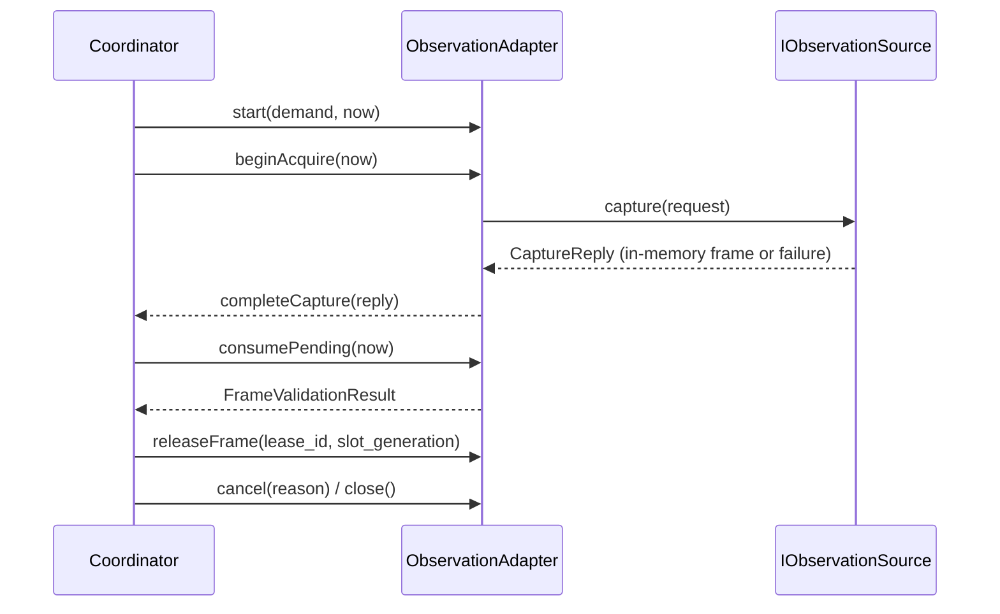

# PR12B observation adapter

## Purpose

This change adds the first executable boundary for step-triggered observation without starting a game process, reading a desktop surface, invoking OCR, sending keyboard or mouse input, or writing image files. It is deliberately a replay/fake adapter: the same `ObservationAdapter` lifecycle can later be connected to a Windows Graphics Capture or DXGI implementation through `IObservationSource`.

The adapter treats an observation demand as a bounded capability for one business step. It never starts a background capture loop and it never retries a failed frame inside an adapter call.

## Files

```text
src/application/runtime/observation/observation_adapter.h
src/application/runtime/observation/observation_adapter.cpp
tests/runtime/observation_adapter_tests.cpp
```

The parent build integration should add the two source files to `relink_runtime`, add `observation_adapter_tests` linked to `relink_runtime` and `Qt6::Core`, and register it with CTest. No UI, SQLite, Windows capture, OCR, or external-process dependency is required.

## API boundary

`ObservationDemand` carries the complete step barrier:

- `demandId` and `RuntimeContext` (`runId`, `sessionId`, `clockDomainId`, `stepId`, `cancelEpoch`, `viewportGeneration`);
- `one_shot` or `bounded_watch` mode;
- purpose, monotonic creation/not-before/deadline times;
- conservative `maxFrameAgeMs`;
- request budget and bounded-watch interval;
- physical-pixel ROI specifications with transform versions;
- fixed `persistence = none`.

`IObservationSource` is the future capture seam:

```cpp
class IObservationSource {
public:
    virtual ~IObservationSource() = default;
    virtual CaptureReply capture(const CaptureRequest& request) = 0;
    virtual void cancel(const QString& demandId,
                        const RuntimeContext& context) = 0;
    virtual QString sourceKind() const = 0;
};
```

A Windows backend may use `beginAcquire()` and `completeCapture()` (the reply must echo both the generated `requestId` and `requestNumber`) to bridge an asynchronous WGC/DXGI callback. The synchronous `acquire()` method is only a convenience wrapper for the deterministic replay source. No method accepts an image path.

`IObservationRecognizer` is intentionally separate. It receives one accepted `FrameEnvelope` in memory and returns a result string/error; it cannot request an implicit second frame. This keeps future OCR implementation independent from capture and from the UI.

## Lifecycle



States represented by the adapter are `Created`, `Active`, `Satisfied`, `Expired`, `Cancelled`, `Rejected`, and `Closed`. Resource flags are kept separately: a frame can be accepted while its lease is still in use, and a pending/in-use frame blocks the next bounded-watch acquire. Cancellation immediately prevents new acquisitions and calls `IObservationSource::cancel`; a matching late callback is converted to `Cancelled` and cannot advance business state. An old/missing request identity is rejected without clearing the current in-flight request. `resourcesDraining` and `resourcesDrained` distinguish logical termination from actual resource return. `close()` reaches `Closed` only after the pending frame is cleared, any in-flight callback has drained, and an in-use frame has received its matching release.

### One-shot

`frameBudget` must be `1` and `minIntervalMs` must be `0`. Exactly one request is counted, including an empty or failed response. A valid frame becomes `Satisfied`; stale, unproven, malformed, or empty output becomes `Expired`. There is no hidden retry.

### Bounded watch

The budget is counted at `beginAcquire`, not at successful frame delivery. `watchTick(now)` can issue one request only when the demand is active, due, within its deadline, below budget, outside the minimum interval, and without a pending/in-use frame. A consumer must call `consumePending()` and then `releaseFrame()` before another request. Budget exhaustion stops new requests but does not expire a final in-flight request or discard a pending result. The adapter waits until the demand deadline unless a one-shot has already produced its terminal result. Every state-changing timestamp entry point validates a safe integer in `0..2^53-1` and rejects backward time. Every demand requires `createdMonoMs < deadlineMonoMs`.

The coordinator calls `deadlineTick(now)` for an explicitly arbitrated deadline event. At `now == deadline`, a result arbitrated first may be consumed; a deadline event arbitrated first makes later same-millisecond results stale. Any entry point at `now > deadline` expires the demand regardless of frame budget or in-flight/pending/in-use state and cancels the source. Expiration drops pending pixels but keeps in-use leases until release.

## Freshness and validation gates

`consumePending()` applies these gates in order:

1. demand/session/clock/step/epoch/viewport identity must match exactly;
2. frame metadata, BGRA8 shape, stride, byte count, lease and capture interval must be valid; source kind must equal the registered source kind, not just be an allowed enum;
3. `source_timestamp` requires `sourceMonoMs` and an uncertainty bound. The conservative lower bound is `sourceMonoMs - sourceUncertaintyMs`;
4. `post_barrier_capture` requires `captureStartMonoMs >= notBeforeMonoMs`;
5. `unproven` is diagnostic-only and returns `E_STALE_OR_UNPROVEN_FRAME`;
6. raw source timestamp, capture interval end and conservative lower bound must not be in the future; the lower bound must be at/after the step barrier and no older than `maxFrameAgeMs` at consumption time;
7. every ROI must fit the frame in client physical pixels. It is rejected with `E_ROI_OUT_OF_BOUNDS` rather than silently clipped.

The adapter does not compare timestamps across clock domains. It also does not use OCR completion time as the pixel observation time.

## In-memory replay source

`InMemoryReplaySource` queues captured frames, empty results, and failures. Synthetic frames are deterministic BGRA8 byte arrays with replay metadata, a generated lease ID, and alternating slot indexes. The queue is consumed once per request. Synthetic dimensions are checked before `width * 4`, byte-count multiplication or allocation. Source queues retain at most 600 replies, at most 128 MiB of queued pixels, at most 600 request-history entries, and at most 600 cancellation identities; retained metadata strings are capped at 200 UTF-16 units. A full cancellation registry rejects all further captures rather than evicting old cancelled IDs and accidentally re-enabling them. The single-demand adapter itself retains at most one pending/in-use pixel array; the bounded synthetic fixture queue is test input, not a production capture queue. `captureCallCount()` and `requests()` make the request budget and interval observable in tests. `imageFileWriteCount()` is a constant zero and no filesystem API appears in the implementation.

The replay source is not a real desktop capture implementation. It exists to prove lifecycle, context, freshness, ROI and cancellation behavior before M2 enables a read-only Windows capture backend.

## Verification matrix

`tests/runtime/observation_adapter_tests.cpp` covers:

| Case | Expected result |
|---|---|
| valid one-shot source-timestamp frame | accepted once, lease released, zero image writes |
| source timestamp uncertainty crosses barrier | `E_STALE_OR_UNPROVEN_FRAME` |
| unproven freshness | rejected before any business observation |
| old session/context | `E_CONTEXT_MISMATCH`, no state advance |
| bounded-watch interval and two-frame budget | no early tick, no concurrent acquire, exactly two requests |
| cancel with a late callback | source cancellation recorded; late frame cannot be consumed |
| invalid/equal deadline and unsafe clock values | demand rejected before capture |
| backward acquisition/callback/consume time | rejected without losing in-flight/pending resources |
| expiry with zero budget used, in-flight, pending or in-use frame | source cancelled, new requests blocked, resource draining tracked |
| explicit deadline-first / result-first at same millisecond | deterministic accepted versus expired behavior |
| duplicated/missing old callback identity | current later request remains in-flight |
| close while frame is in use or capture awaits callback | `Closed` only after matching release/callback |
| future source time hidden by uncertainty, future capture time | rejected |
| source kind differs from configured source | `E_SOURCE_KIND` |
| oversized, negative or overflowing synthetic dimensions | rejected before image allocation |
| reply/history/cancellation queue bounds | bounded retained metadata and no image writes |
| ROI outside frame | `E_ROI_OUT_OF_BOUNDS` |

The tests use only synthetic memory. They do not load `BBZPS`, start a process, touch a game window, invoke OCR/OpenCV, or write screenshots/temp images.

## Parent build integration

Add these entries without changing the adapter implementation:

```cmake
# Extend relink_runtime
src/application/runtime/observation/observation_adapter.cpp
src/application/runtime/observation/observation_adapter.h

add_executable(observation_adapter_tests
  tests/runtime/observation_adapter_tests.cpp)
target_include_directories(observation_adapter_tests PRIVATE src)
target_link_libraries(observation_adapter_tests PRIVATE relink_runtime Qt6::Core)
add_test(NAME observation_adapter_tests COMMAND observation_adapter_tests)
```

The real Windows capture/OCR work remains a separate gate. It should only begin after a reviewed WGC/DXGI design, a target-window test matrix, and an explicit request to exercise actual game-screen observation.

## Offline hardening verification status

The hardening test suite prints its exact assertion count through `std::printf`, alongside failures and image-file-write count. The focused hardening build and run completed on 2026-10-06:

```text
.tools/aqt-env/Scripts/cmake.exe --build build_relocated --target observation_adapter_tests -j 2
Build exit: 0; no compiler warnings
build_relocated/observation_adapter_tests.exe
OBSERVATION_ADAPTER_TESTS=PASS; assertions=828; failures=0; image_file_writes=0
Test exit: 0
```

The commands used the repository Qt 6.8.3/MinGW and CMake directories in `PATH`. Root owns final full CTest/package validation. This is the new request-identity/draining hardening run, not the earlier PR12B scaffold result.
